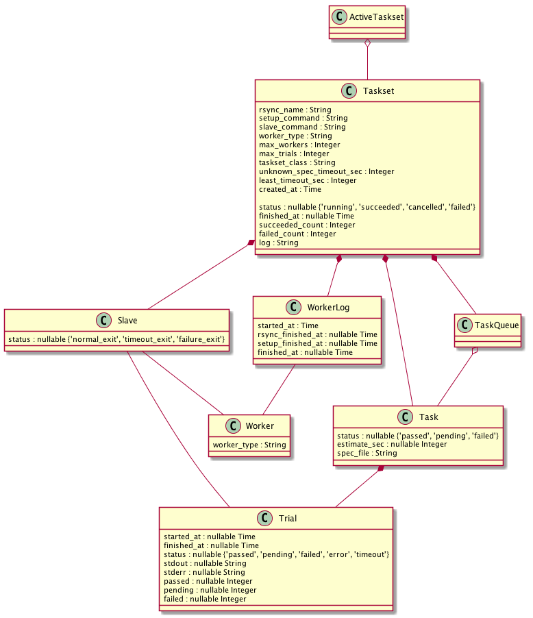
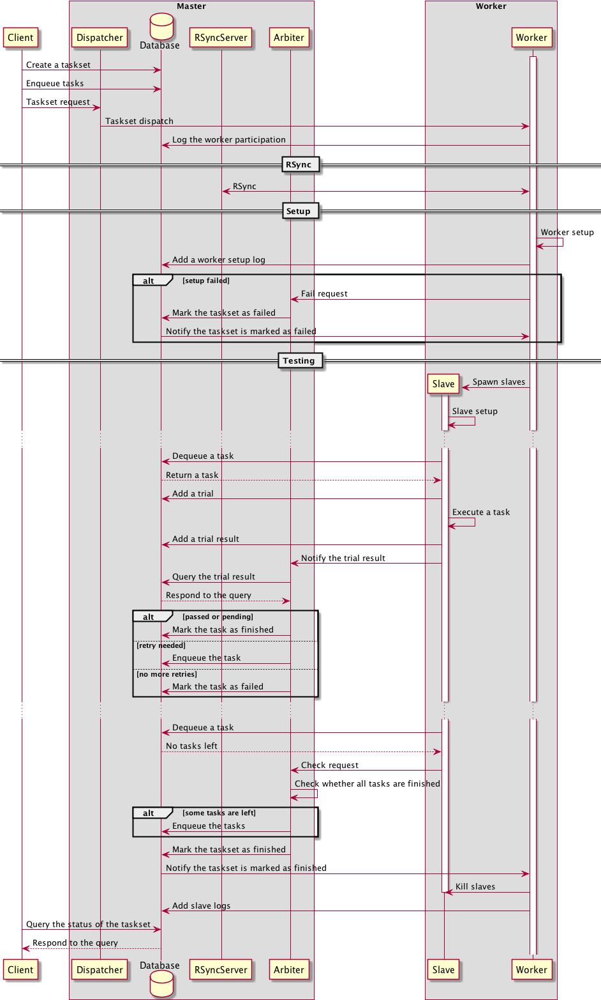
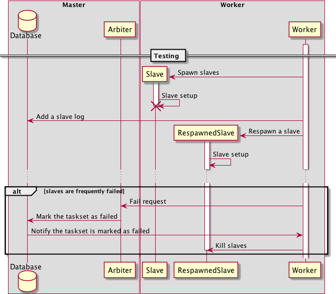
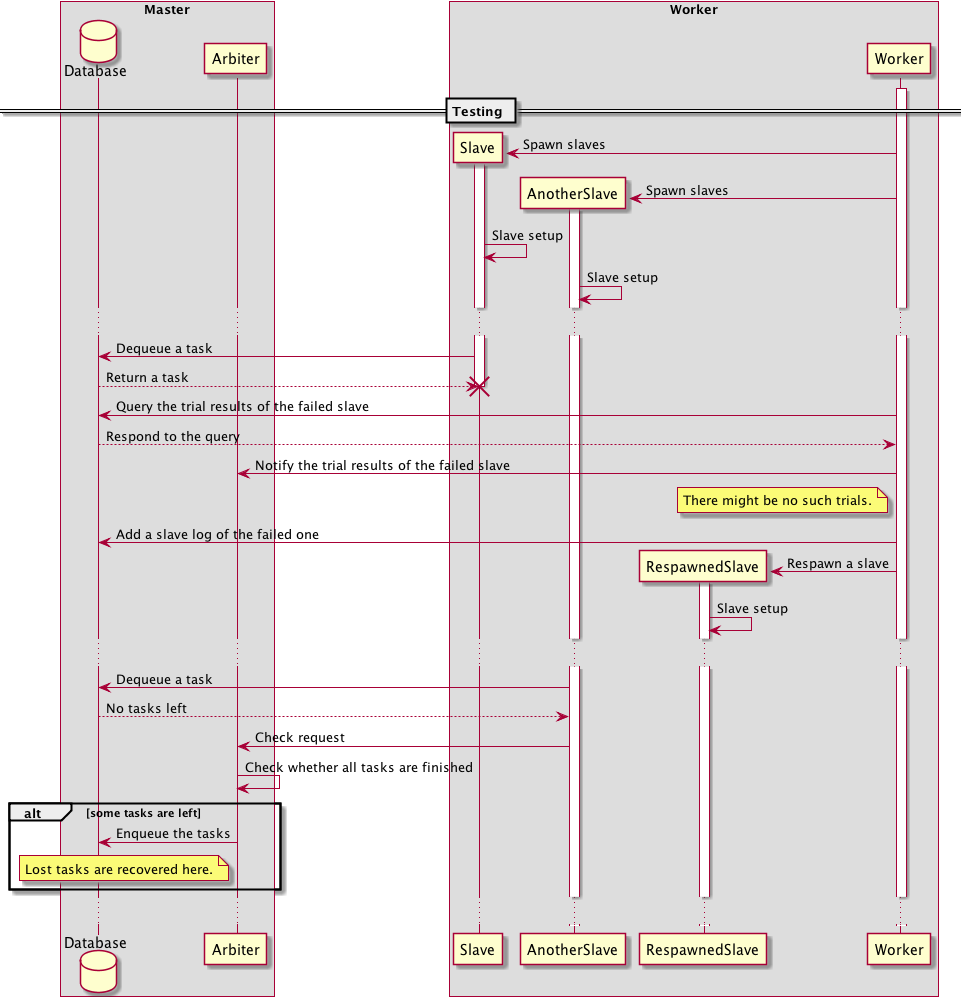
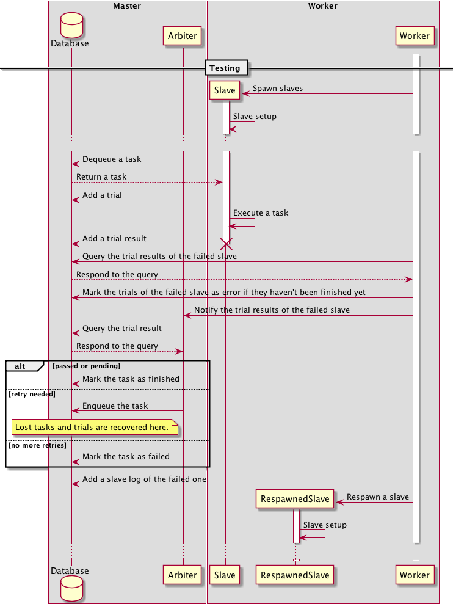
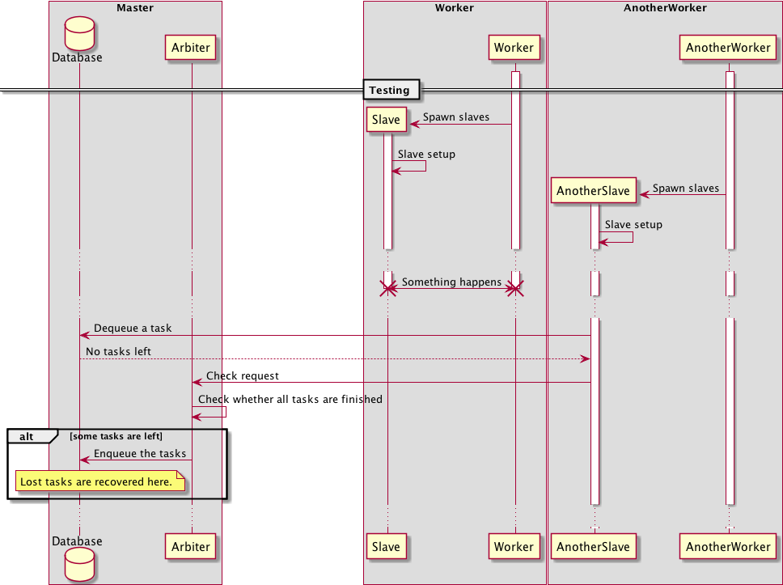

# RRRSpec Hacking Guide

RRRSpec is splitted into several gems:

* rrrspec-client: Client and Slaves
* rrrspec-server: Dispatcher, Arbiter, and Worker
* rrrspec-web

## Objects

* Task: one `*_spec.rb` file
* Taskset: a set of tasks
* Trial: one execution result of task

## Actors

There are several actors in the system:

* Client: Create a taskset
* Dispatcher: Dispatch a taskset to the workers
* Worker: Create and destroy slaves
* Slave: Execute tasks and report their results to the arbiter
* Arbiter: Determine whether a task is completed

## Data structure

## Sequence

### Normal

### The setup process is failed

### A slave is failed after dequeuing a task

### A slave is failed while testing

### A worker is failed

## Verification

To verify the fault-tolerance properies of RRRSpec, a model checker
[Sandal](https://github.com/draftcode/sandal) is created, but the model of
RRRSpec is not yet created.

